> *OPENLANE 1.0.2* — WSL2 setup, OpenLane + Sky130A PDK installation, and picorv32a full RTL-to-GDSII flow with custom standard cell integration.

---

## 📋 Table of Contents

- [System Requirements](#system-requirements)
- [Setup](#setup)
  - [Step 1 — Docker Desktop](#step-1--docker-desktop)
  - [Step 2 — Directory Structure & Repository Setup](#step-2--directory-structure--repository-setup)
  - [Step 3 — OpenLane Installation & Sky130 PDK Setup](#step-3--openlane-installation--sky130-pdk-setup)
  - [Step 4 — Workshop Design Setup](#step-4--workshop-design-setup)
  - [Step 5 — Run the Full Automated Flow (picorv32a)](#step-5--run-the-full-automated-flow-picorv32a)
  - [Step 6 — View Layout in Magic](#step-6--view-layout-in-magic)
- [Day-wise Learning Log](#day-wise-learning-log)
  - [Day 1: Introduction to ASIC Flow & Synthesis](#day-1-introduction-to-asic-flow--synthesis)
  - [Day 2: Floorplan & Placement](#day-2-floorplan--placement)
  - [Day 3: Custom Standard Cell Design (Inverter)](#day-3-custom-standard-cell-design-inverter)
  - [Day 4: Custom Cell Integration & CTS](#day-4-custom-cell-integration--cts)
  - [Day 5: Routing & DRC](#day-5-routing--drc)
- [Key Paths Reference](#key-paths-reference)
- [Standard Workflow (After Initial Setup)](#standard-workflow-after-initial-setup)
- [Troubleshooting](#troubleshooting)
- [References](#references)

---

## 🖥️ System Requirements

| Requirement | Specification |
|-------------|---------------|
| OS | Windows 11 |
| WSL | WSL2 with Ubuntu 22.04 |
| RAM | 8–16 GB minimum |
| Disk Space | ~50–100 GB free (Docker image ~3–4 GB + Sky130A PDK ~5 GB) |

---

## ⚙️ Setup

### Step 1 — Docker Desktop

Download and install **Docker Desktop**. During installation, enable **"Use WSL2 instead of Hyper-V"**.

After installation:
- **Settings → Resources → WSL Integration** → enable for **Ubuntu-22.04**
- **Settings → General** → enable **"Start Docker Desktop when you login"**

Verify Docker is working:

```bash
docker run hello-world
# Expected output: Hello from Docker!
```


---

### Step 2 — Directory Structure & Repository Setup

```bash
mkdir ~/openlane && cd ~/openlane
git clone https://github.com/The-OpenROAD-Project/OpenLane.git
git clone https://github.com/vsdip/vsd-openlane.git
```

This gives you two repos:

```
~/openlane/
├── OpenLane/        ← Engine (tools, Docker setup, PDK manager)
└── vsd-openlane/    ← Workshop (design files, instructions)
```

> **Note:** `vsd-openlane` contains a hidden `.openlane-designs` folder — only visible with `ls -la`

---

### Step 3 — OpenLane Installation & Sky130 PDK Setup

```bash
cd ~/openlane/OpenLane
make
```

This pulls the Docker image (~3–4 GB) and installs the Sky130A PDK (~5 GB). Takes ~30 minutes on first run.

PDK will be installed at: `~/.ciel/sky130A/`

Verify the installation:

```bash
make test
# Expected output:
# [SUCCESS]: Flow complete.
# [INFO]: There are no setup or hold violations in the design.
```


---

### Step 4 — Workshop Design Setup

The `.openlane-designs` folder is hidden — verify it exists first:

```bash
ls -la ~/openlane/vsd-openlane/
```

Copy the `picorv32a` design into OpenLane:

```bash
cp -r ~/openlane/vsd-openlane/.openlane-designs/picorv32a \\
      ~/openlane/OpenLane/designs/
```

Verify the copy:

```bash
ls ~/openlane/OpenLane/designs/picorv32a
# Expected: config.tcl  src/
```


---

### Step 5 — Run the Full Automated Flow (picorv32a)

```bash
cd ~/openlane/OpenLane
make mount
```

Inside the container:

```bash
./flow.tcl -design picorv32a -verbose 1
```

Takes ~20–25 minutes. Expected output:

```
[SUCCESS]: Flow complete.
[INFO]: There are no setup violations in the design.
[INFO]: There are no hold violations in the design.
```

Run output is saved at:

```
~/openlane/OpenLane/designs/picorv32a/runs/RUN_<timestamp>/
├── results/final/      ← GDSII, DEF, LEF files
├── reports/            ← timing, DRC, metrics
└── logs/               ← per-step logs
```

---

### Step 6 — View Layout in Magic

Magic is launched **inside the Docker container** (the container has Magic 8.3.413 which is version-matched to Sky130A PDK; the Ubuntu apt version is too old).

```bash
cd ~/openlane/OpenLane
make mount
```

Inside the container:

```bash
magic -T $PDK_ROOT/sky130A/libs.tech/magic/sky130A.tech &
```

The GUI forwards automatically to Windows 11 via **WSLg** — no extra configuration needed.

In the Magic **tkcon** window, load the layout:

```tcl
cd designs/picorv32a/runs/RUN_<timestamp>/tmp/
lef read merged.nom.lef
cd ../results/final/def/
def read picorv32a.def
```

Press **`V`** to zoom fit — the full routed picorv32a layout will be visible.

> **Screenshot Placeholder:**  
> 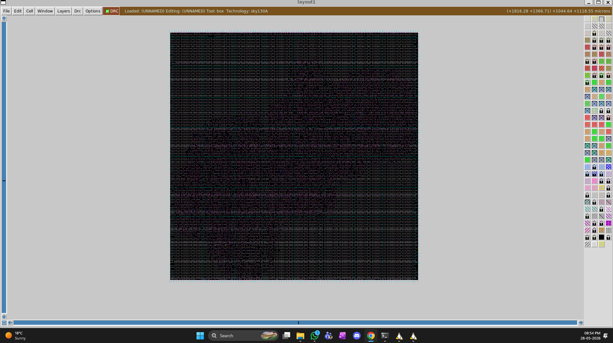  
> *Caption: Final routed picorv32a layout viewed in Magic*

---

## 📅 Day-wise Learning Log

---

### Day 1: Introduction to ASIC Flow & Synthesis

**Lectures Covered:** 1–12

#### Lecture 1: Embedded Design vs Chip Design
- **Package:** QFN 4 (7×7) mm example
- **Chip =** Digital logics + pads + Die + pin = Package
- **RISC-V SoC components:** ADC, DAC, PLL, SRAM (foundry IPs) + RISC-V core, GPIO bank, SPI (macros)
- **Foundry:** Manufacturing place of SoC
- **IP:** Intellectual Property
- **PDK (Process Design Kit):** Communication bridge between designer and foundry for fabrication

#### Lecture 2: RISC-V ISA
```
C program → Compiler → RISC Assembly → Assembler → Machine Language (Hex/Binary) → RTL (HDL) → Netlist → Physical Design → Chip
```

#### Lecture 3: App to Chip Abstraction
```
Apps → System Software (OS → Compiler → Assembler) → HDL → Hardware
```
- **OS:** Handles I/O, memory allocation, low-level functions
- **Compiler:** HLL (C, C++, Java) to instructions (.exe)
- **Assembler:** Instructions to Hex/Binary (machine language)

#### Lecture 4: SoC Design Using OpenLane
```
RTL IPs + Macros + PDK + EDA Tools = RTL to GDSII Flow (ASIC Flow)
```
- **RTL Sources:** LibreCores, OpenCores
- **Open EDA Tools:** Qflow, OpenROAD, Magic
- **PDK:** SkyWater 130 nm (June 30, 2020)
- **PDK contains:** DRC, LVS, EX rules, design models, I/O libraries, standard cells, tech info

#### Lecture 5: RTL to GDSII Flow Steps
```
RTL → Synthesis → Floorplanning → Power Planning → Placement → Clock Tree Synthesis → Routing → Sign-off → GDSII
```
- **Synthesis:** Code to digital logic gates using standard cells (multiple varieties based on PPA)
- **Floorplanning:** Plan chip area and macros area
- **Power Planning:** VDD/GND rails for the chip
- **Placement:** Global and detailed placement of gates
- **CTS:** Low skew clock distribution to all sequential circuits
- **Routing:** Global routing (guides) + detailed routing (wires following guides)
- **Sign-off:** Physical verification (DRC, LVS) + Timing verification (STA)

#### Lecture 6: OpenLane Advantage
- OpenLane solves version control and tool calibration problems via **Docker containerization**

#### Lecture 7: OpenLane Toolchain
```
RTL + Yosys (Synthesis) → ABC scripts → Gate-level netlist with SCL + DFT (Fault) + OpenROAD (FP/PP to Routing) + Antenna check + LEC + RC Extraction + DRC + LVS + OpenSTA
```

#### Lecture 8: SkyWater PDK Structure
```
~/.ciel/sky130A/
├── libs.tech/     ← Tool-specific files
└── libs.ref/      ← Technology-specific files
    ├── lib/       ← Liberty timing files
    ├── lef/       ← LEF files
    └── tlef/      ← Technology LEF files
```
- **Sky130A PDK:** `sky130_fd_sc_hd` (high density) — the SCL we use

#### Lecture 9: Interactive Flow — Overwriting config.tcl
- How to overwrite `.tcl` file in picorv32a design
- Interactive flow run
- Package require for OpenLane
- Prep files and merging LEF

#### Lecture 10: Interactive Run Structure
- Contents of `tmp/`, `results/`, and `config.tcl` (default parameters)
- Running `run_synthesis`

#### Lecture 11: GitHub — Efabless OpenLane Repo
- Introduction to the official OpenLane repository
- FOSSi Dial-up playlist reference

#### Lecture 12: Continuing Interactive Session
```bash
# Start
make mount
./flow.tcl -interactive

# Load
package require openlane

# Resume (overwrite previous run)
prep -design picorv32a -tag VSD_workshop -overwrite

# Next step
run_floorplan
```

#### Practical Lab Work — Day 1

**Commands executed:**
```bash
cd ~/openlane/OpenLane
make mount

# Inside container
./flow.tcl -interactive
package require openlane
prep -design picorv32a -tag day1 -overwrite
run_synthesis
```

**Screenshot Placeholders:**
> 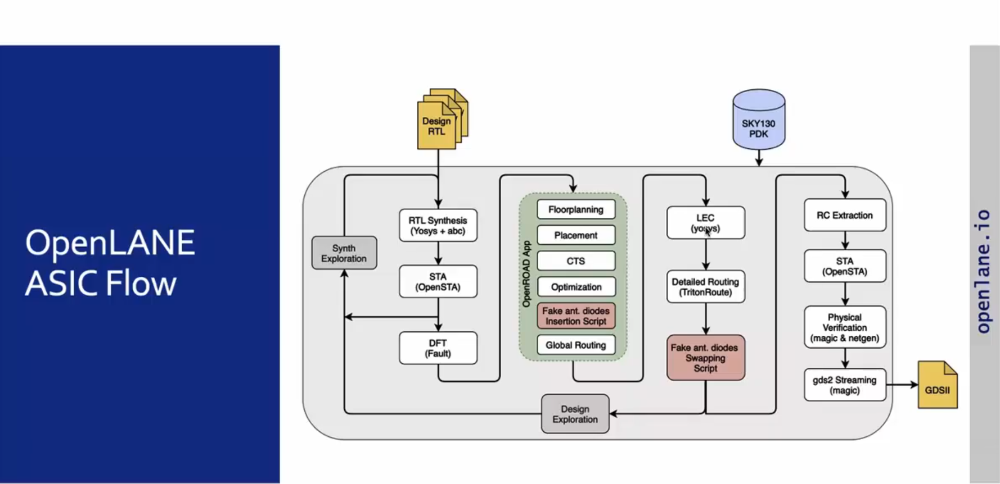  
> *Caption: OpenLane RTL-to-GDSII flow diagram*

> 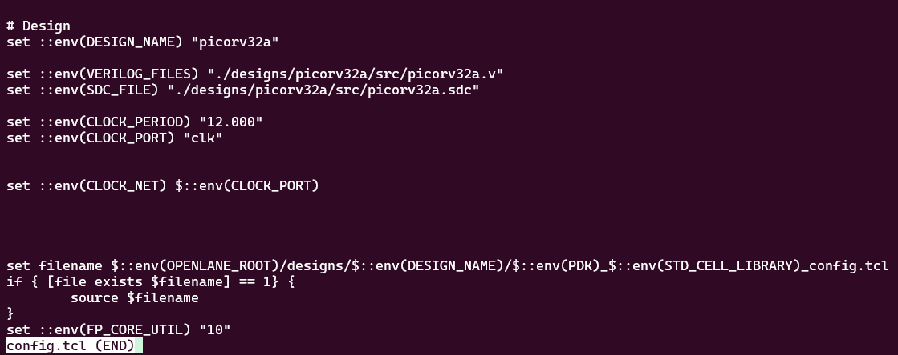  
> *Caption: picorv32a config.tcl default parameters*

> 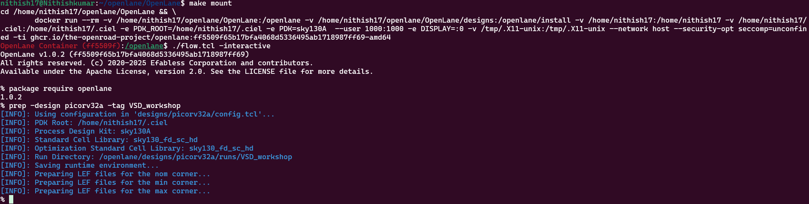  
> *Caption: LEF merging and design preparation in interactive mode*

> 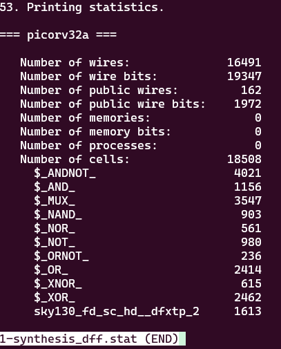  
> *Caption: Synthesis completion message*

**Files checked:**
```
runs/picorv32a/runs/day1/
├── results/synthesis/     ← Synthesized netlist
├── reports/synthesis/     ← Area, timing reports
│   └── 1-synthesis.AREA_0.stat.rpt
└── logs/synthesis/          ← Yosys, ABC logs
```

**Nomenclature explained:**
```
1-synthesis.AREA_0.stat.rpt
│   │         │      │     └── rpt = report (human readable)
│   │         │      └──────── stat = statistics
│   │         └───────────────── AREA_0 = optimization run 0
│   └───────────────────────────── which tool/stage ran
└────────────────────────────────── step number in the flow
```

**D-flop ratio check:** Checked in synthesis reports for sequential vs combinational cell ratio.

---

### Day 2: Floorplan & Placement

**Lectures Covered:** Floorplanning (1–8), Placement (9–13), Cell Design (14–19)

#### Lecture 1: Floorplanning Basics
- Only **macros** are placed in this stage; standard cells placed later
- Define **dimensions** (width and height) of core and die
- Standard cells (AND, OR, etc.) and registers (flip-flops) dimensions needed
- **Core** is inside **Die**; circuit is inside core only
- **Utilization Factor:** `(Total area occupied by core / Total area of core) × 100`
- **Aspect Ratio:** `Height of core / Width of core` = 1 means square core
- If utilization < 100%, optimization possible

#### Lecture 2: Preplaced Cells
- Frequently used combinational sections → **black-boxed as IP** for replication
- Market-ready IPs: memory, mux, comparator, clock gating cell
- **Floorplanning =** arrangement of these IPs
- IPs have **user-defined placement** — placed before automated placement
- Automated P&R handles remaining logical cells

#### Lecture 3: Decoupling Capacitors
- Preplaced cell position based on peripherals (input near input side, etc.)
- **Decoupling capacitors** surround preplaced cells
- Purpose: Compensate voltage drop during 0→1, 1→0 transitions
- Acts as **secondary power source** to keep logic in defined region (not between noise margins)

#### Lecture 4: Power Planning
- Multiple cell combos connected → need signal maintenance across circuit
- Multiple capacitor discharge → **ground bounce** or **voltage droop** → undefined region
- Solution: **Multiple VDD and VSS lines** as grid/mesh → multiple power supply points
- Logic cells and decoupling capacitors tap from nearest point

#### Lecture 5: Pin Placement
- **Netlist:** Connectivity information of different gates
- Area between core and die used for **pin placement**
- Input/output ports placed based on preplaced cell locations
- Clock ports **larger** than signal ports (driven continuously, need least resistivity)
- Space between core and die **blocked** to prevent logic placement
- **Floorplanning complete!**

#### Lecture 6: Floorplan Configuration
- Default switches in `.tcl` file in OpenLane configuration
- Can be **overwritten** by design's `config.tcl`

#### Lecture 7: Die Area Calculation
- Die area found in `.def` file of results
- Units in **database units**: `1 micron = 1000 database units`
- Calculate die area in microns from DEF file

#### Lecture 8: Floorplanned Layout Exploration
- Multiple cells visible: I/O ports, decap cells, **tap cells** (to avoid CMOS latch-up)
- Standard cells visible at bottom but **not included** in floorplanning stage

#### Lecture 9: Placement Introduction
- **Binding netlist with physical cells** using SCL of PDK

#### Lecture 10: Buffer Insertion
- Long wires + large capacitance → signal loss over distance
- **Buffers** inserted between standard cells to maintain signal integrity
- Trade-off: lose area, gain signal integrity

#### Lecture 11: Slew & Routing
- **Slew condition** decides if buffer needed
- If 2 cell paths criss-cross → paths in **different layers** (routing technique)

#### Lecture 12: Cell Characterization Need
- Need characterization to make EDA tools understand cells in SCL

#### Lecture 13: Placement Types
```bash
run_placement
```
- **Global placement:** Cells placed in rows/columns; reduces wire length; doesn't care about legalization (overlapping)
- **Detailed placement:** 3rd dimension (height/layer) to avoid overlapping; obeys legalization
- **Important factors:**
  - **Overflow:** Should reduce to converge design
  - **HPWL:** Half-Perimeter Wire Length

#### Lecture 14: Standard Cell Library
- SCL contains cells of different functionality based on size, threshold voltage
- **Cell Design Flow:**
  - **Input:** PDK + DRC/LVS rules + SPICE models + library + user-defined specs

#### Lecture 15: Cell Dimensions
- **Cell height:** Distance between VDD and GND rail
- **Cell width:** Based on drive strength
- **User-defined specs:** Cell width, height, supply voltage, metal layer, pin location, drawn gate length

#### Lecture 16: Layout Design
- CMOS parameters → circuit design → network graph → **Euler path** → **stick diagram** → layout
- **Output:** Circuit description language, GDSII, LEF, extracted SPICE netlist (parasitic RC)
- **Characterization reports:** Timing, power, noise → `.lib` files

#### Lecture 17: Characterization Flow (8 Steps)
1. Read NMOS and PMOS model
2. Read extracted SPICE netlist
3. Recognize buffer behavior
4. Read sub-circuit
5. Attach power source
6. Apply stimulus
7. Provide output capacitor (NLDM: variable capacitor)
8. Necessary simulation commands

→ Feed to **GUNA** software → generates power, noise, timing files

#### Lecture 18: Timing Characterization
- **Slew thresholds:**
  - Slew low rise thr = 20% of VDD
  - Slew high rise thr = 80% of VDD
  - Slew low fall thr = 20% of VDD
  - Slew high fall thr = 80% of VDD
- **Delay thresholds:**
  - In_rise_thr = 50% of input rise
  - In_fall_thr = 50% of input fall
  - Out_rise_thr = 50% of output rise
  - Out_fall_thr = 50% of output fall
- **Rise delay:** In_rise_thr period - out_rise_thr period
- **Fall delay:** In_fall_thr period - out_fall_thr period

#### Lecture 19: Propagation Delay & Transition Time
- **Propagation delay:** In_rise_thr - out_fall_thr (should always be positive)
- **Transition time:**
  - Input slew = Slew high rise thr - Slew low rise thr
  - Output slew = Slew high fall thr - Slew low fall thr

#### Practical Lab Work — Day 2

**Commands executed:**
```bash
cd ~/openlane/OpenLane
make mount

# Inside container (resume from Day 1)
./flow.tcl -interactive
package require openlane
prep -design picorv32a -tag day2 -overwrite
run_synthesis
run_floorplan
run_placement
```

**Screenshot Placeholders:**

> 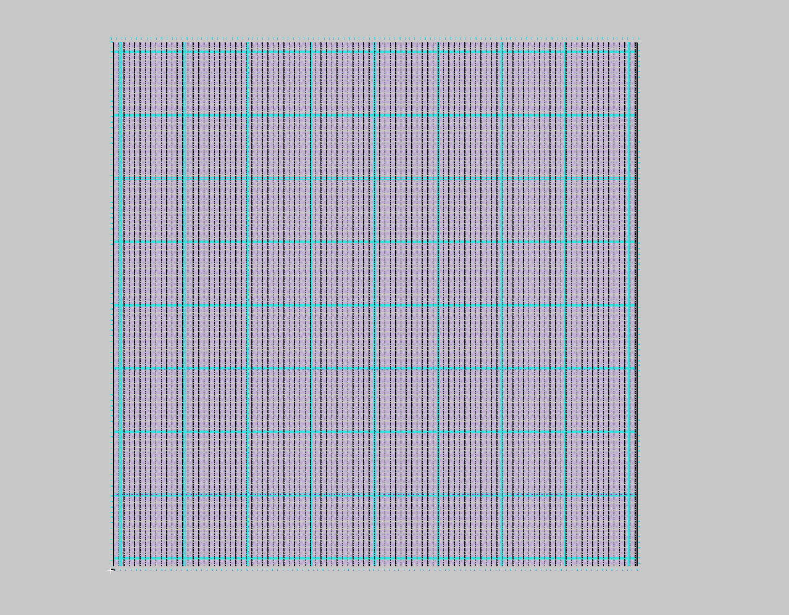  
> *Caption: Floorplan layout viewed in Magic — I/O ports, tap cells, decap cells visible*

> 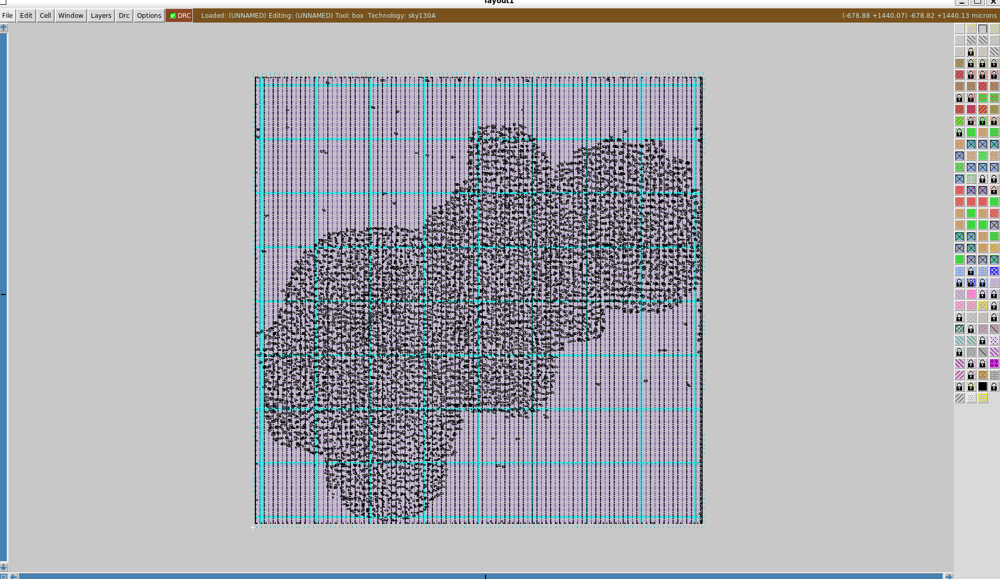  
> *Caption: Placement layout in Magic — standard cells placed in rows*

**Magic commands for viewing:**
```tcl
# For Floorplan
magic -T $PDK_ROOT/sky130A/libs.tech/magic/sky130A.tech &
lef read designs/picorv32a/runs/day2/tmp/merged.nom.lef
def read designs/picorv32a/runs/day2/results/floorplan/picorv32a.def

# For Placement
lef read designs/picorv32a/runs/day2/tmp/merged.nom.lef
def read designs/picorv32a/runs/day2/results/placement/picorv32a.def
```

**Key observations:**
- Floorplan shows die boundary, core area, I/O ports, preplaced macros, tap cells, decap cells
- Placement shows standard cells arranged in rows with legalization
- Checked utilization factor and aspect ratio in floorplan reports

---

### Day 3: Custom Standard Cell Design (Inverter)

**Lectures Covered:** CMOS VTC, SPICE Simulation, 16-Mask Process, Magic Layout Extraction

#### Lecture 0: IO Placer Strategy
- Changing IO placer strategy from **equi-distant** to **Hungarian algorithm** based placement

#### Lecture 1: VTC Characteristics of CMOS
- Using 250 nm or 350 nm CMOS for SPICE simulation
- **SPICE deck:** Netlist of component connectivity (gate, source, drain, substrate, tap point, load capacitor)
- **Dynamic load capacitor:** 10 fF for static analysis
- **PMOS/NMOS W/L ratio:** Ideally PMOS twice as big as NMOS
- **Nodes:** Defined between components; GND = 0
- **SPICE syntax:**
  ```spice
  *** comments ***
  Mos_name drain gate substrate source type W L
  Capacitor_name node1 node2 value
  Supply_voltage_name node1 node2 voltage_value
  .op
  .dc Supply_name sweep_start sweep_stop sweep_step
  .LIB "mos_model.mod" CMOS_MODELS
  .end
  ```

#### Lecture 2: SPICE Deck Scenarios
- **Scenario 1:** Wp/Lp = Wn/Ln → Low threshold
- **Scenario 2:** Wp/Lp = 2.5 × Wn/Ln → Higher threshold (graph shifts right)

#### Lecture 3: CMOS Robustness — Threshold Voltage (Vm)
- **Vm:** Voltage where both NMOS and PMOS are in saturation
- At Vm: Vin = Vout, Vgs = Vds, Idsn = -Idsp
- Leakage current produced at threshold

#### Lecture 4–5: Transient SPICE Simulation
- Transient simulation performed to find **rise delay** and **fall delay**
- Cloned **vsdstdcelldesign** repo CMOS `.mag` file
- Viewed through **Magic** software from OpenLane container

#### Lecture 6–12: 16-Mask CMOS Process
1. **Substrate selection:** P or N type, high resistivity, doping level, orientation
2. **Active region creation:**
   - Silicon oxide + silicon nitride deposition for isolation
   - Photoresist + mask + UV lithography → etching → pattern
   - **LOCOS process:** Oxidation growth under exposed areas (bird's beak)
   - Nitride removal by phosphoric acid etching
3. **P-well and N-well formation:** Mask half, etch, create wells for NMOS/PMOS
4. **Gate formation:** N-type polysilicon for gate resistance
5. **Lightly doped drain (LDD):** Prevent hot electron effect, short channel effect
   - Sidewall spacers to protect doping mix
6. **Source/Drain formation:** Through annealing
7. **Contacts and interconnects:** Titanium sputtering, TiN for local connection, RCA cleaning
8. **Higher level metal formation:** Multiple metal layers

#### Lecture 13: CMOS Stack & Layout Extraction
```
Metal
Licon
Local I
N-substrate contact
N-well
```
- CMOS stacked between power and ground rail
- **Magic commands for SPICE extraction:**
  ```tcl
  extract
  ext2spice
  ```
- Converts layout to SPICE netlist with parasitic elements

#### SPICE Simulation Results (Inverter)

**Rise Transition:**
```
20% of 3.3V = 0.66V to 80% = 2.67V
x0 = 2.24009e-09, y0 = 2.6703
x0 = 2.17946e-09, y0 = 0.66
Rise transition = 0.061 ns
```

**Fall Transition:**
```
x0 = 4.04946e-09, y0 = 2.66988
x0 = 4.09369e-09, y0 = 0.67
Fall transition = 0.044 ns
```

**Propagation Delay (Rise):**
```
Input fall 50% → Output rise 50%
x0 = 2.15161e-09, y0 = 1.65063
x0 = 2.20968e-09, y0 = 1.65
Rise delay = 0.058 ns
```

**Propagation Delay (Fall):**
```
Input rise 50% → Output fall 50%
x0 = 4.05045e-09, y0 = 1.64944
x0 = 4.07568e-09, y0 = 1.65
Fall delay = 0.025 ns
```

#### Practical Lab Work — Day 3

**Commands executed:**
```bash
# Clone vsdstdcelldesign repo for custom inverter
git clone https://github.com/nickson-jose/vsdstdcelldesign.git

# In OpenLane container
cd ~/openlane/OpenLane
make mount

# Inside container — view custom cell
magic -T $PDK_ROOT/sky130A/libs.tech/magic/sky130A.tech vsdstdcelldesign/sky130_inv.mag &

# Extract to SPICE
extract
ext2spice
```

**Screenshot Placeholders:**
> 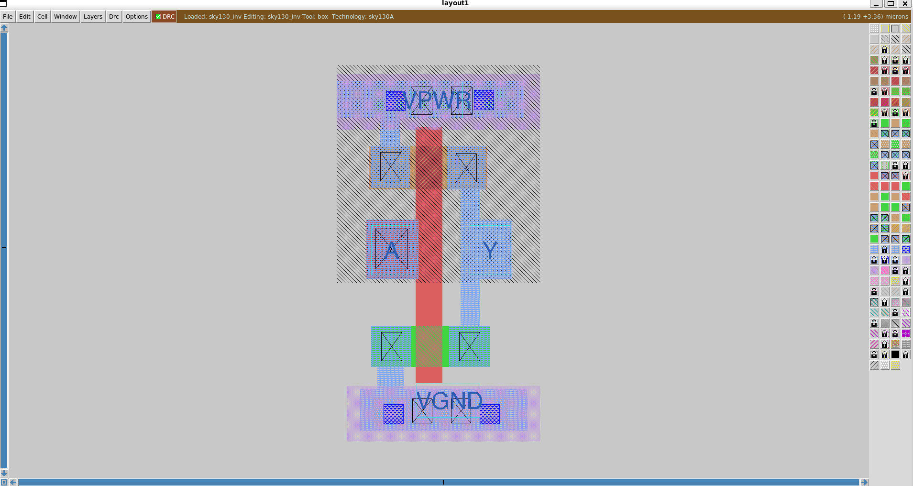  
> *Caption: Custom inverter layout in Magic — PMOS (top), NMOS (bottom), power/ground rails*

> 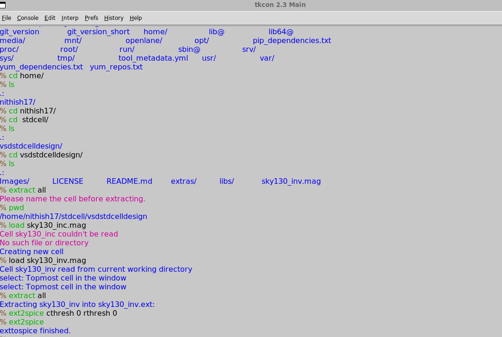  
> *Caption: Magic extract and ext2spice commands converting layout to SPICE netlist*

> 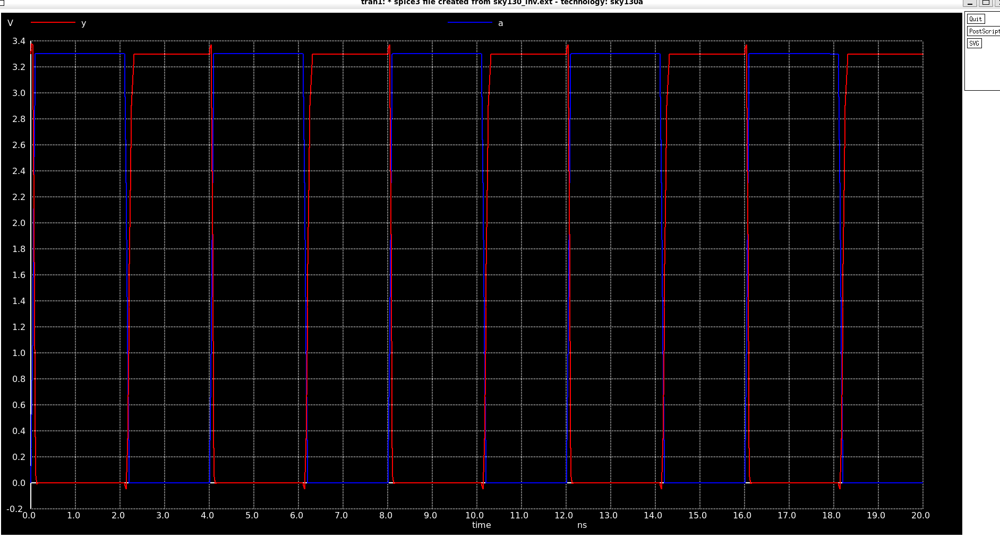  
> *Caption: SPICE simulation waveform showing input/output transitions and delay measurements*

**Next step:** Convert inverter layout to LEF and add to picorv32a flow.

---

### Day 4: Custom Cell Integration & CTS

**Lectures Covered:** LEF Extraction, Custom Cell Integration, Power-Aware CTS, Setup Time Analysis

#### Lecture 1: PR Boundary, Power Rails, Ports
- **Extracting LEF from .mag files**
- Rules for standard cell layout to be placed in picorv32a:
  - Ports must be at intersection of **horizontal and vertical tracks**
  - Width: odd multiple of X direction (e.g., 3 grid boxes in inverter)
  - Height: must match standard cell row height

#### Lecture 2: Tracks & Port Configuration
- **tracks.info** in PDK defines routing grid
- Cross-section ensures route can reach port from horizontal and vertical directions
- **Label each port** — allocate as input or output
- Set **port class** and **port use** in file
- Save `.mag` file with new name, create LEF with `lef write`

#### Lecture 3: Adding Custom LEF to OpenLane
- Integrate custom `.lef` into OpenLane flow
- Update `config.tcl` to include custom cell library

#### Lecture 4–7: Power-Aware CTS & Delay Tables
- **Power-aware CTS:** Using AND/OR gates with enable pins
  - OR gate: 0 is enable pin
  - AND gate: 1 is enable pin
- **Purpose:** Endpoints active only at particular times → power saving
- **Delay tables:** Find delay at node through buffer delay tables
- **Same buffer requirement:** If 2 endpoints have different delays, slew won't be zero
  - Must use same buffer driving same load at every level
- **Custom cell integration results:**
  - Combined custom cell with merged LEF
  - Improved `SYNTH_STRATEGY` and buffering/driving cells
  - **Slack improved** (decreased negative slack, increased positive slack)
  - Verified custom macro present in merged LEF
  - `run_placement` successful with custom cell!

#### Lecture 8: Setup Time Analysis
- **Setup time:** Minimum time data must be stable before clock edge
- **Jitter:** Clock edge variation
- **Delay equation:** `Delay = T - (S + J)`
  - S = setup time
  - J = jitter
- **Fix slack issues:** Upsize buffer (one method)

#### Clock Tree Synthesis (CTS)
- **H-Tree:** Through midpoint of sequential components
- **Buffering:** Clock buffers different from logic buffers — equal rise and fall time
- **Clock net shielding:** Encapsulation of clock to avoid glitch from coupling capacitance
- **Delta delay:** From decoupling, increases delay, increases skew
- Data nets sometimes shielded too

#### Setup Time Analysis with Real Clock
- Analysis with ideal clock → real clock → multiple clocks

#### Practical Lab Work — Day 4

**Commands executed:**
```bash
cd ~/openlane/OpenLane
make mount

# Inside container
./flow.tcl -interactive
package require openlane
prep -design picorv32a -tag day4 -overwrite

# Updated config.tcl to include custom LEF
# Set SYNTH_STRATEGY to DELAY 1 for better timing
set ::env(SYNTH_STRATEGY) "DELAY 1"

run_synthesis
run_floorplan
run_placement
run_cts
```

**Screenshot Placeholders:**
> 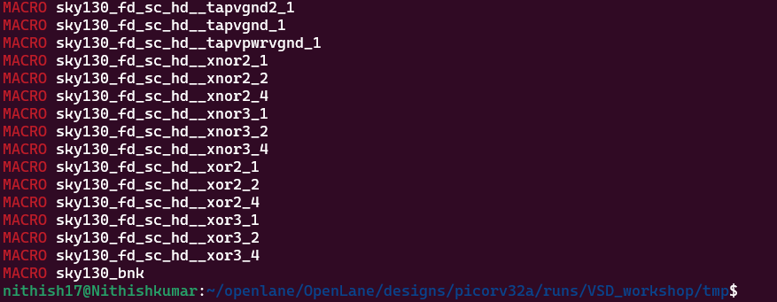  
> *Caption: Custom inverter cell included in merged LEF file*

> 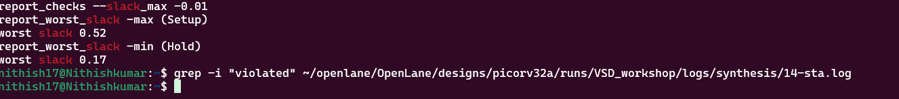  
> *Caption: Timing report showing poor slack before optimization*

> 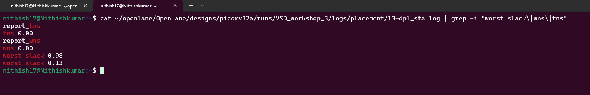  
> *Caption: Improved slack after setting SYNTH_STRATEGY to "DELAY 1"*

**Key observations:**
- Custom cell successfully integrated into picorv32a flow
- `SYNTH_STRATEGY "DELAY 1"` significantly improved timing slack
- Placement successful with custom standard cell
- Clock tree synthesis completed with power-aware configuration

---

### Day 5: Routing & DRC

**Lectures Covered:** Routing Algorithms, DRC Rules, TritonRoute, PDN Generation

#### Lecture 1: Routing Introduction
- **Routing:** Best possible route between 2 points
- **Algorithms:**
  - **Maze routing — Lee's Algorithm:**
    - Creates grid on floorplan
    - Numbers non-zigzag adjacent boxes with integers in ascending order
    - Continues until reaching destination
    - **Least bent option chosen**

#### DRC Rules
- **Minimum distance** between 2 parallel routes (wire pitch and wire spacing)
- **Minimum wire width** must be followed
- **Signal short:** When 2 routes crisscross → place in **2 different layers**
- **Via rules:** Minimum via width, via spacing
- **Parasitics extraction:** Extract RC values from routed layout

#### PDN Generation
```bash
gen_pdn
```
- Power distribution network generation
- How to extract parasitic elements

#### Lecture 2: Run Routing
```bash
run_routing
```
- **2 types:**
  - **Fast routing:** Focus only on 2D aspect
  - **Detailed routing:** 3D approach including layering

#### TritonRoute Features
- Initial route guides
- **Splitting, Merging, Bridging**
- Preprocessed guides
- Inter-guide connectivity
- **Intra and inter-layer sequential panel routing**

**Inputs:** LEF, DEF, preprocessed route guides  
**Output:** Detailed routing solution with optimized wire length

**Constraints:**
- Route guide honoring
- Design rules
- Connectivity constraints

**Key concepts:**
- **Access point** and **access point clusters**
- **Routing topology algorithm**

#### Practical Lab Work — Day 5

**Commands executed:**
```bash
cd ~/openlane/OpenLane
make mount

# Inside container (continue from Day 4)
./flow.tcl -interactive
package require openlane
prep -design picorv32a -tag day5 -overwrite

# Full flow from synthesis to routing
run_synthesis
run_floorplan
run_placement
run_cts
gen_pdn
run_routing
```

**Key observations:**
- Routing completed successfully with TritonRoute
- DRC clean — no violations reported
- Parasitic extraction performed for timing sign-off
- Full RTL-to-GDSII flow completed for picorv32a with custom inverter cell!

---

## 🗺️ Key Paths Reference

| Location | Path |
|----------|------|
| Workshop repo | `~/openlane/vsd-openlane/` |
| OpenLane engine | `~/openlane/OpenLane/` |
| PDK | `~/.ciel/sky130A/` |
| picorv32a design | `~/openlane/OpenLane/designs/picorv32a/` |
| Run output | `~/openlane/OpenLane/designs/picorv32a/runs/RUN_<timestamp>/` |
| Final results | `.../runs/RUN_<timestamp>/results/final/` |
| Inside container | `/openLANE_flow/` → maps to `~/openlane/OpenLane/` |
| PDK inside Docker | `$PDK_ROOT/sky130A/` |

---

## 🔄 Standard Workflow (After Initial Setup)

```bash
# 1. Start Docker Desktop from Windows Start Menu

# 2. Enter the OpenLane container
cd ~/openlane/OpenLane
make mount

# 3. Run the full automated flow (inside container)
./flow.tcl -design picorv32a -verbose 1

# 4. Open Magic for layout viewing (inside container)
magic -T $PDK_ROOT/sky130A/libs.tech/magic/sky130A.tech &
```

---

## 🐛 Troubleshooting

| Issue | Solution |
|-------|----------|
| WSL2 memory limit | Create `.wslconfig` in Windows home: `[wsl2] memory=8GB` |
| Docker permission denied | `sudo usermod -aG docker $USER` then restart WSL |
| OpenLane PDK missing | Run `make pdk` or `make setup` again |
| Magic display error | Ensure `DISPLAY` is set: `export DISPLAY=:0` |
| Custom LEF not found | Verify path in `config.tcl` and file permissions |
| Slack violations | Try `set ::env(SYNTH_STRATEGY) "DELAY 1"` or upsize buffers |

---

## 📚 References

- [OpenLane Official Documentation](https://openlane.readthedocs.io/)
- [OpenLane GitHub Repository](https://github.com/The-OpenROAD-Project/OpenLane)
- [VSD OpenLane Workshop](https://github.com/vsdip/vsd-openlane)
- [VSD Standard Cell Design](https://github.com/nickson-jose/vsdstdcelldesign)
- [WSL Documentation](https://docs.microsoft.com/en-us/windows/wsl/)
- [Magic VLSI Layout Tool](http://www.opencircuitdesign.com/magic/)
- [SkyWater PDK](https://github.com/google/skywater-pdk)
- [FOSSi Dial-up Playlist](https://www.youtube.com/playlist?list=PLUgS-ZpL0yS3V3jP6iFGccg0PuyO28pDQ)

---

> **Last Updated:** 2025-06-05  
> **Total Days Logged:** 5  
> **Workshop:** VSD OpenLane Workshop  
> **OpenLane Version:** v1.0.2 (ff5509f)  
> **PDK:** SkyWater 130A (sky130_fd_sc_hd)  
> **Platform:** WSL2 Ubuntu 22.04 on Windows 11
"""

# Save to file
output_path = "/mnt/agents/output/README.md"
with open(output_path, "w", encoding="utf-8") as f:
    f.write(readme_content)

print(f"README.md saved successfully to: {output_path}")
print(f"File size: {len(readme_content)} characters")
